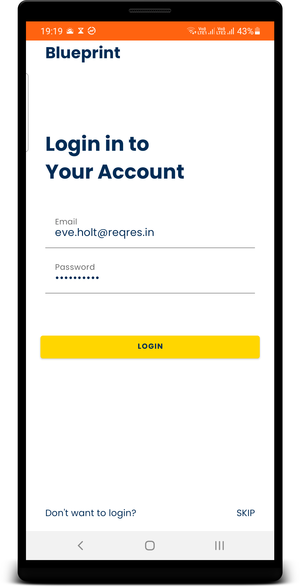
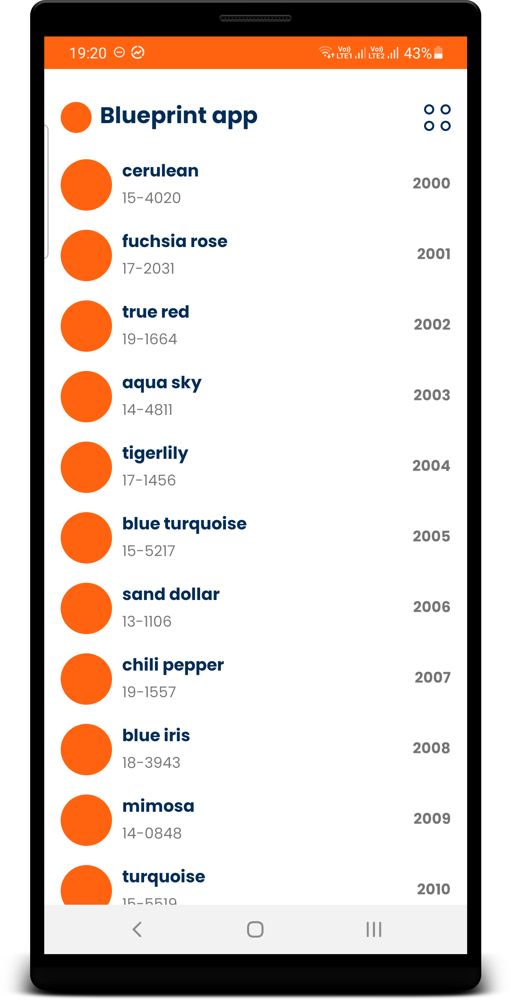
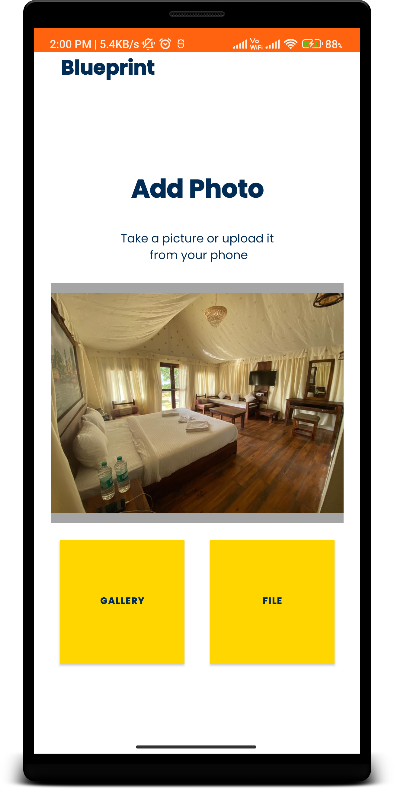
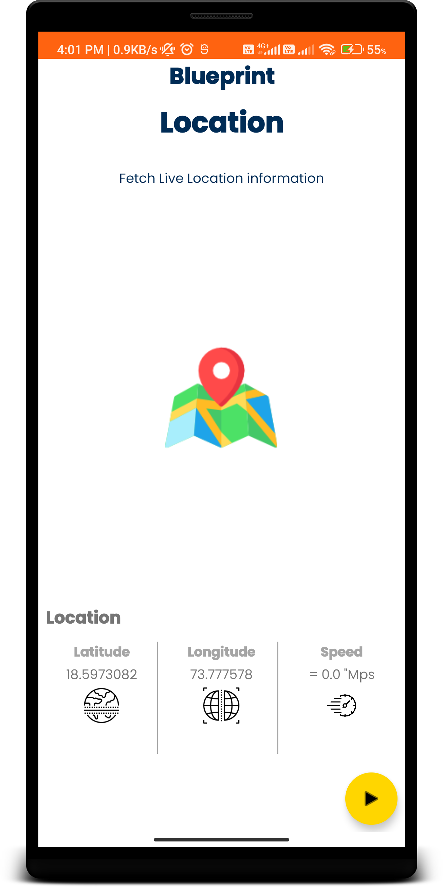

# mobile-android [](https://sonarcloud.io/summary/new_code?id=NeoSOFT-Technologies_mobile-android)

mobile-android is an application development framework - a toolkit - for people who build android apps using kotlin. 
Its goal is to enable you to develop projects much faster than you could if you were writing code from scratch, by providing a rich set of libraries for commonly needed tasks, as well as a simple interface and logical structure to access these libraries. 

This lets you creatively focus on your project by minimizing the amount of code needed for a given task. 


## How to use 👣

The app is no-frills, but sufficiently complex that you can use it as a template to build upon.

Just click on [](https://github.com/NeoSOFT-Technologies/mobile-android/generate) button to create a new repo starting from this template.


## Screenshots

​    

​    


Libraries Used
--------------
* [Architecture](https://developer.android.com/topic/libraries/architecture)
  * [ViewModel](https://developer.android.com/topic/libraries/architecture/viewmodel) - Store UI-related data that isn't destroyed on app rotations. Easily schedule asynchronous tasks for optimal execution. 
  * [LiveData](https://developer.android.com/topic/libraries/architecture/livedata) - Build data objects that notify views when the underlying database changes. 
  * [Lifecycles](https://developer.android.com/topic/libraries/architecture/lifecycle) - Create a UI that automatically responds to lifecycle events. 
  * [Data Binding](https://developer.android.com/topic/libraries/data-binding/) - Library that allows you to bind UI components in your layouts to data sources in your app using a declarative format rather than programmatically.
* [Dependency Injection](https://en.wikipedia.org/wiki/Dependency_injection) 
  * [HILT](https://developer.android.com/training/dependency-injection/hilt-android) - Hilt is built on top of the popular DI library Dagger to benefit from the compile time correctness, runtime performance, scalability, and Android Studio support that Dagger provides. Recommended by Android.
* Logging
  * [Timber](https://github.com/JakeWharton/timber) - A logger with a small, extensible API which provides utility on top of Android's normal Log class.
  * [OkHttp Logging Interceptor](https://github.com/square/okhttp/tree/master/okhttp-logging-interceptor)
* Database
  * [Room](https://developer.android.com/jetpack/androidx/releases/room) - Store offline database
* Networking
  * [Retrofit](https://square.github.io/retrofit/) - A type-safe HTTP client for Android
* [Coroutines](https://developer.android.com/kotlin/coroutines) - Light wight threads for asynchronous programming
* CI
  - [GitHub Actions](https://github.com/features/actions)
  - Automatic PR verification including tests, linters and sonarqube analysis
* Gradle
  - [Gradle Kotlin DSL](https://docs.gradle.org/current/userguide/kotlin_dsl.html)
* [Test](https://developer.android.com/training/testing/) - An Android testing framework for unit and runtime UI tests. Given When Then — Our Testing Approach
  * [Unit Tests](https://en.wikipedia.org/wiki/Unit_testing) ([JUnit 5](https://junit.org/junit5/) via [android-junit5](https://github.com/mannodermaus/android-junit5))
  * [UT Tests](https://en.wikipedia.org/wiki/Graphical_user_interface_testing) ([Espresso](https://developer.android.com/training/testing/espresso))
  * [Mockk](https://mockk.io/)


Common Features
-------------------

* Clean Architecture
* Adhering to SOLID Principles 
* Repository Pattern for code separations 
* Dependency Injection 
* Simple Network Layer 
* Simple Data Layer 
* Better Logging
* Automatic Error Handling 
* Media Selection Module  
* Generic Permission Handler
* Flavors Sample 
* Unit & Integration Tests 
* CI for build release 
* CD (TODO) 
* Use SonarQube Analysis & generate reports 
* Crashlytics/Analytics


## Gradle Setup 

This template is using [**Gradle Kotlin DSL**](https://docs.gradle.org/current/userguide/kotlin_dsl.html) as well as the [Plugin DSL](https://docs.gradle.org/current/userguide/plugins.html#sec:plugins_block) to setup the build.

Dependencies are inside the *.kt files in the `buildSrc` folder. This provides convenient auto-completion when writing your gradle files.


## Documentation


* **MVVM - Model View ViewModel**

  * Robust, testable, and maintainable app with classes for managing your UI component lifecycle and handling data persistence.

  To learn more about the different architecture approach see, [Common Architecture Design Patterns](wiki/docs/discussion/COMMON_ANDROID_ARCHITECTURAL_PATTERNS.md) 

* [**Clean Architecture**](wiki/docs/modules/app-clean-arch-overview.md) for separation of concern & **modular approach**

* Every Activity/Fragment needs to extend BaseActivity/BaseFragment

* Every Activity will have a DataBinding object and ViewModel object defined in this way:

```KOTLIN
abstract class BaseActivity<B : ViewDataBinding, VM : BaseViewModel> : AppCompatActivity() {
```

### Clean Architecture & Components in Android App


To learn more about the app architecture see [Architecture Overview](wiki/docs/modules/architecture-overview.md)

### 1. Request & Response Flow

Following diagram shows the diagram of how the request & response flow works for the boilerplate,


### 2. Modules

- [Architecture Overview](wiki/docs/modules/architecture-overview.md)
- [Request Manager](wiki/docs/modules/request-manager.md)
- [Automatic Exception Handling](wiki/docs/modules/exception-handling.md)
- [Generic Runtime Permission Handler](wiki/docs/modules/permission-handler.md)
- [GeoLocation Tracker](wiki/docs/modules/geo-location.md)
- [Biometric Authenticator](wiki/docs/modules/biometric.md)
- [Media Selection](wiki/docs/modules/media-selection.md)
- [Database](wiki/docs/modules/database-flow.md)
- [Network](wiki/docs/modules/network-flow.md)
- [Crashlytics](wiki/docs/modules/crashlytics.md)
- [Logger](wiki/docs/modules/logger.md)
- [Dependency Injection]()
- [App Testing](wiki/docs/modules/app-testing.md)


### 3. File Structure

Folder structure options and naming conventions for software projects

#### Top-level directory layout

```
app                          # Application core implementation
├── .github/workflows        # Github workflow files
├── buildSrc                 # Kotlin DSL for setup build & dependencies
├── crash-reporting          # Crash reporting module/lib
├── biometric                # Biometric Authenticator
├── data                     # Layer exposes all data source
├── domain                   # Domain layer contains all the use cases of your application
├── presentation             # Prepares data for the application layer & maintains state
├── errors                   # Exception handling pure Kotlin implementation
├── errors-android           # Exception handling android counterpart implementation
├── geolocation              # Module to track user geolocation
├── media-android            # Media Picker pure Kotlin implementation
├── media-library            # Media Picker android counterpart implementation
├── permissions              # Permission handling pure Kotlin implementation
├── permissions-android      # Permission handling android counterpart implementation
├── logger                   # Text-based logging library
├── screenshots              # Project screenshots
├── utils                    # Project utils
└── wiki                     # Documentation files
```

> Use short lowercase names at least for the top-level files and folders except `LICENSE`, `README.md`


#### Documentation files

```
app
├── ...
└── wiki
    └── docs  # Documentation files
        ├── contribution
        │   └── CONTRIBUTING.md                           # Contribution doc
        ├── discussion                                    # WHY-Series documents
        │   ├── COMMON_ANDROID_ARCHITECTURAL_PATTERNS.md
        │   ├── WHEN_COROUTINES_AND_RxJAVA.md
        │   ├── WHY_DEPENDENCY_INJECTION.md
        │   ├── WHY_KOTLIN.md
        │   └── WHY_REPOSITORY.md
        ├── guide                                         # Project practices guides
        │   ├── KOTLIN_STYLE_GUIDE.md
        │   ├── VERSIONING_GUIDE.md
        │   └── XML_STYLE_GUIDE.md
        └── modules
            ├── assets                                    # Wiki Artifacts
            └── *.md                                      # Module level wiki documents
```


#### Automated tests

Automated tests are usually placed into the `test` or, less commonly, into the `tests` folder.

> **Q: Why tests are placed into a separate folder, as opposed to having them closer to the code under test?**
>
> **A:** Because you don't want to test the code, you want to test the *program*.

```
.
├── ...
├── src
│   ├── androidTest/  # Instrumented test, which will execute on an Android device
│   ├── ..
│   └── test/         # Example local unit test, which will execute on the development machine (host)
└── ...
```


## CI Pipeline

CI is utilizing [GitHub Actions](https://github.com/features/actions). Complete GitHub Actions config is located in the [.github/workflows](.github/workflows) folder.


## PR Verification

Series of workflows runs (in parallel) for every opened PR and after merging PR to `main` branch:

- `./gradlew lintDebug` - Runs Android lint
- `./gradlew testDebugUnitTest` - Run unit tests
- `./gradlew build sonarqube --info` - Analyzing Using Gradle Sonar Plugin

To learn more about contributing to this project see [Guiding principles for contributing](wiki/docs/contribution/CONTRIBUTING.md)

### 

## Coding Guidelines

- [Kotlin Coding Conventions](https://kotlinlang.org/docs/reference/coding-conventions.html)
- [Kotlin Style Guide](wiki/docs/guide/KOTLIN_STYLE_GUIDE.md)
- [XML Style Guide](wiki/docs/guide/XML_STYLE_GUIDE.md)


## Discussion (The WHY Series)

* [Why Kotlin?](wiki/docs/discussion/WHY_KOTLIN.md)
* [Why MVVM & Common Android Archiectural Patterns](wiki/docs/discussion/COMMON_ANDROID_ARCHITECTURAL_PATTERNS.md)
 * [When I can choose Coroutines or RX-Kotlin to do some behaviour ](wiki/docs/discussion/WHEN_COROUTINES_AND_RxJAVA.md)
 * [Why Dependency Injection? Why HILT? ](wiki/docs/discussion/WHY_DEPENDENCY_INJECTION.md)
 * [Why should you use the repository pattern?](wiki/docs/discussion/WHY_REPOSITORY.md)


## Upcoming Improvements

Checklist of all upcoming [enhancements](https://github.com/NeoSOFT-Technologies/mobile-android/issues?q=is%3Aissue+is%3Aopen+sort%3Aupdated-desc+label%3Aenhancement).


## Inspiration

This is project is a sample, to inspire you and should handle most of the common cases, but please take a look at additional resources.

### Cheat sheet

- [Core App Quality Checklist](https://developer.android.com/quality) - learn about building the high-quality app
- [Android Ecosystem Cheat Sheet](https://github.com/igorwojda/android-ecosystem-cheat-sheet) - board containing 200+ most important tools
- [Kotlin Coroutines - Use Cases on Android](https://github.com/LukasLechnerDev/Kotlin-Coroutine-Use-Cases-on-Android) - most popular coroutine usages

### Android projects

Other high-quality projects will help you to find solutions that work for your project:

- [Android Architecture Blueprints v2](https://github.com/googlesamples/android-architecture) - a showcase of various Android architecture approaches
- [Android sunflower](https://github.com/googlesamples/android-sunflower) complete `Jetpack` sample covering all libraries
- [GithubBrowserSample](https://github.com/googlesamples/android-architecture-components) - multiple small projects demonstrating usage of Android Architecture Components
- [Plaid](https://github.com/android/plaid) - a showcase of Android material design
- [Clean Architecture boilerplate](https://github.com/bufferapp/android-clean-architecture-boilerplate) - contains nice diagrams of Clean Architecture layers
- [Android samples](https://github.com/android) - official Android samples repository
- [Roxie](https://github.com/ww-tech/roxie) - solid example of `common state` approach together witch very good documentation
- [Kotlin Android template](https://github.com/cortinico/kotlin-android-template) - template that lets you create an Android/Kotlin project and be up and running in a few seconds.


## Known Issues

* delay(timeMillis: 1L) added to avoid manual Resource state emission. ([Issue 25](https://github.com/NeoSOFT-Technologies/mobile-android/issues/25))


## Contributing to this Project

Contributions are welcome from anyone and everyone. We encourage you to review the [guiding principles for contributing](wiki/docs/contribution/CONTRIBUTING.md)


## App Versioning Syntax

[Android Mobile App Versioning](wiki/docs/guide/VERSIONING_GUIDE.md)

