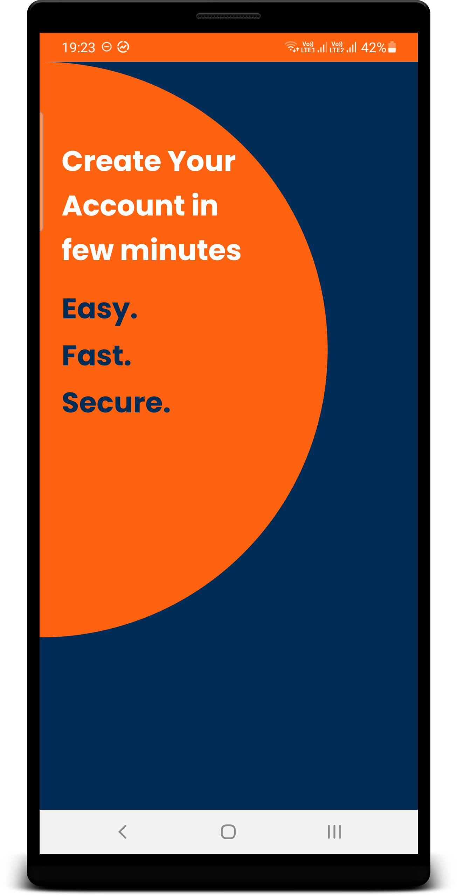
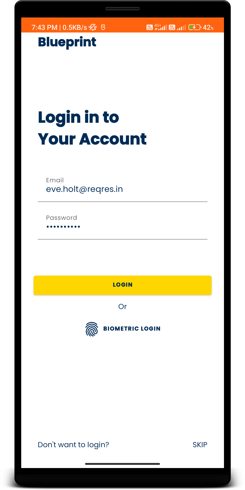

# mobile-android [](https://sonarcloud.io/summary/new_code?id=NeoSOFT-Technologies_mobile-android)

mobile-android is an application development framework - a toolkit - for people who build android apps using kotlin. 
Its goal is to enable you to develop projects much faster than you could if you were writing code from scratch, by providing a rich set of libraries for commonly needed tasks, as well as a simple interface and logical structure to access these libraries. 

This lets you creatively focus on your project by minimizing the amount of code needed for a given task. 


## How to use 👣

The app is no-frills, but sufficiently complex that you can use it as a template to build upon.

Just click on [](https://github.com/NeoSOFT-Technologies/mobile-android/generate) button to create a new repo starting from this template.


Architecture Design Pattern
--------------
**MVVM - Model View ViewModel**
* Robust, testable, and maintainable app with classes for managing your UI component lifecycle and handling data persistence.

## Screenshots

​    


Libraries Used
--------------
* [Architecture](https://developer.android.com/topic/libraries/architecture)
  * [ViewModel](https://developer.android.com/topic/libraries/architecture/viewmodel) - Store UI-related data that isn't destroyed on app rotations. Easily schedule asynchronous tasks for optimal execution. 
  * [LiveData](https://developer.android.com/topic/libraries/architecture/livedata) - Build data objects that notify views when the underlying database changes. 
  * [Lifecycles](https://developer.android.com/topic/libraries/architecture/lifecycle) - Create a UI that automatically responds to lifecycle events. 
  * [Data Binding](https://developer.android.com/topic/libraries/data-binding/) - Library that allows you to bind UI components in your layouts to data sources in your app using a declarative format rather than programmatically.
* [Dependency Injection](https://en.wikipedia.org/wiki/Dependency_injection) 
  * [HILT](https://developer.android.com/training/dependency-injection/hilt-android) - Hilt is built on top of the popular DI library Dagger to benefit from the compile time correctness, runtime performance, scalability, and Android Studio support that Dagger provides. Recommended by Android.
* Logging
  * [Timber](https://github.com/JakeWharton/timber) - A logger with a small, extensible API which provides utility on top of Android's normal Log class.
  * [OkHttp Logging Interceptor](https://github.com/square/okhttp/tree/master/okhttp-logging-interceptor)
* Networking
  * [Retrofit](https://square.github.io/retrofit/) - A type-safe HTTP client for Android
  * [Coroutines](https://developer.android.com/kotlin/coroutines) - Light wight threads for asynchronous programming
  * [Test](https://developer.android.com/training/testing/) - An Android testing framework for unit and runtime UI tests.


Common Features
-------------------
* Adhering to SOLID Principles 
* Repository Pattern for code separations 
* Dependency Injection 
* Simple Network Layer 
* Simple Data Layer 
* Better Logging
* Error Handling 
* Flavors Sample 
* Unit & Integration Tests 
* CI for build release 
* CD (TODO) 
* Use SonarQube Analysis & generate reports 
* Crashlytics/Analytics

# Project Architecture Guidelines

* [App Architecture Design Pattern](https://github.com/NeoSOFT-Technologies/mobile-android/blob/main/wiki/docs/discussion/COMMON_ANDROID_ARCHITECTURAL_PATTERNS.md) = **MVVM**
* Every Activity needs to extend BaseActivity
* Every Activity will have a DataBinding object and ViewModel object defined in this way:

```KOTLIN
abstract class BaseActivity<B : ViewDataBinding, VM : BaseViewModel> : AppCompatActivity() {

```

Make use of [Kotlin Extension functions](https://kotlinlang.org/docs/reference/extensions.html) and write as much Extensions functions as possible and less code in Activities and Fragments and only call those extension functions from Activities and Fragments.


## Gradle Setup 

This template is using [**Gradle Kotlin DSL**](https://docs.gradle.org/current/userguide/kotlin_dsl.html) as well as the [Plugin DSL](https://docs.gradle.org/current/userguide/plugins.html#sec:plugins_block) to setup the build.

Dependencies are inside the *.kt files in the `buildSrc` folder. This provides convenient auto-completion when writing your gradle files.


# Documentation


### 1. Request & Response Flow

Following diagram shows the diagram of how the request & response flow works for the boilerplate,


To learn more about architecture see [The Architecture Overview](https://github.com/NeoSOFT-Technologies/mobile-android/blob/main/wiki/docs/modules/architecture-overview.md)

### 2. Modules

- [Architecture Overview](https://github.com/NeoSOFT-Technologies/mobile-android/blob/main/wiki/docs/modules/architecture-overview.md)
- [Automatic Exception Handling](https://github.com/NeoSOFT-Technologies/mobile-android/blob/main/wiki/docs/modules/exception-handling.md)
- [Database](https://github.com/NeoSOFT-Technologies/mobile-android/blob/main/wiki/docs/modules/database-flow.md)
- [Network](https://github.com/NeoSOFT-Technologies/mobile-android/blob/main/wiki/docs/modules/network-flow.md)
- [Crashlytics](https://github.com/NeoSOFT-Technologies/mobile-android/blob/main/wiki/docs/modules/crashlytics.md)
- [Logger](https://github.com/NeoSOFT-Technologies/mobile-android/blob/main/wiki/docs/modules/logger.md)
- [Request Manager](https://github.com/NeoSOFT-Technologies/mobile-android/blob/main/wiki/docs/modules/request-manager.md)
- [Dependency Injection](https://github.com/NeoSOFT-Technologies/mobile-android/blob/main/wiki/docs/modules/dependency-injection.md)


# Coding Guidelines

- [Kotlin Coding Conventions](https://kotlinlang.org/docs/reference/coding-conventions.html)
- [Kotlin Style Guide](wiki/docs/guide/KOTLIN_STYLE_GUIDE.md)
- [XML Style Guide](wiki/docs/guide/XML_STYLE_GUIDE.md)


# Discussion

* [Why Kotlin?](https://github.com/NeoSOFT-Technologies/mobile-android/blob/main/wiki/docs/discussion/WHY_KOTLIN.md)
* [Why MVVM & Common Android Archiectural Patterns](https://github.com/NeoSOFT-Technologies/mobile-android/blob/main/wiki/docs/discussion/COMMON_ANDROID_ARCHITECTURAL_PATTERNS.md)

 * [When I can choose Coroutines or RX-Kotlin to do some behaviour ](https://github.com/NeoSOFT-Technologies/mobile-android/blob/main/wiki/docs/discussion/WHEN_COROUTINES_AND_RxJAVA.md)
 * [Why Dependency Injection? Why HILT? ](https://github.com/NeoSOFT-Technologies/mobile-android/blob/main/wiki/docs/discussion/WHY_DEPENDENCY_INJECTION.md)


# Contributing to this Project

Contributions are welcome from anyone and everyone. We encourage you to review the [guiding principles for contributing](https://github.com/NeoSOFT-Technologies/mobile-android/blob/main/wiki/docs/contribution/CONTRIBUTING.md)


# App Versioning Syntax

[Android Mobile App Versioning](wiki/docs/guide/VERSIONING_GUIDE.md)

