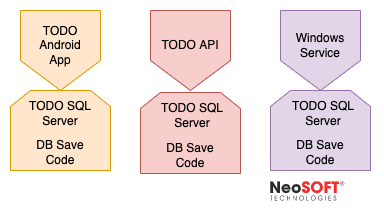
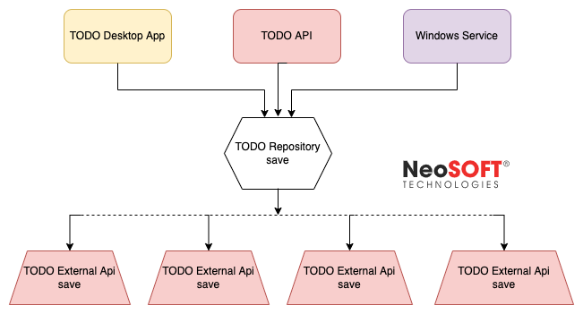

# Why should you use the repository pattern?

The infamous repository pattern.

Let’s talk about what the repository pattern actually is, and some reasons why you might or might not use it.

### What is the repository pattern?

The repository pattern is a strategy for *abstracting data access*. So, to dicect that a bit, data access is made up of the code in an application that deals with storing and retrieving data.

Perhaps you’re using Database to store a bunch of TO-DO list items in a table. You’ve had to write code that interfaces with Database in some way, maybe with Entity Framework, or with some built-in libraries.

So the code is the interface between your `Todo` objects in your application code and your database’s `TodoItem` table row entries.

So, no big deal, right? Why is there a fancy-shmancy pattern out there for abstracting that?

### Why would you abstract the data?

The most obvious reason is the very reason we try to reduce code duplication.

Imagine you wrote that same piece of code over and over in your application. Once in the API so your API could save `Todo` items, a couple times behind the desktop app UI pages, and various other random places for dramatic effect.

Now, what if any of these things happen:

1. A new field is added to the `TodoItem` table in SQL Server.
2. Your company wants to move to MySQL to save money on licenses.
3. You’ve neglected to write unit tests and today is the day you begin.

In each of these cases, you’re going to need to do *a lot* of work to make these changes. Every change to the database table requires a change to *every area of your application that saves the items to that table*. Switching to MySQL would require complete rewrites since that code is locks you in to SQL Server.

Very bad, and very risky.

You know that irritation you get when Apple changes the charging cable type on your phone? You’ve invested so much time and money on accessories for one type, and all that goes out the window. Maybe the iPhone will one day go to USB-C and then the Android and iPhone world will unite in a dongle-free oasis of shared accessories.

This is why you should use the repository pattern. 

All your app wants is `Todo` items, it shouldn’t have to care about how it’s stored or where it comes from.

Now when any of the above changes are needed, you theoretically only have to change the code behind the `save()` method of the repository. Perhaps you’ve got a datastore interface that implements SQL  `INSERT` code, but there’s nothing to prevent you from swapping in one for MySQL, an external API storage mechanism, or even a mock database for unit testing.

### Are there any reasons you shouldn’t use it?

Some reasons I can think of – you wouldn’t use it if your project is small and you truly don’t anticipate large data-level structural changes.

Side projects or demo apps? Hell no, don’t spend hours writing repository code when data access is fixed.

Another reason might be that you’re working on an application that already uses a different strategy. A common strategy I see is having the save/get code inside the entities themselves (like `todo.save()`).

If you’re working on an older project that uses a different pattern, don’t mix the patterns unless you have an objective to separate the data access technology.

### There you have it!

Those are some reasons why I think you, *(yes, you)* should consider using the repository pattern.

