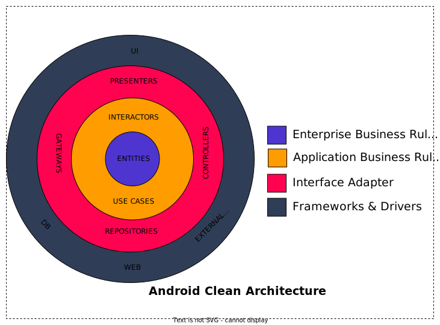
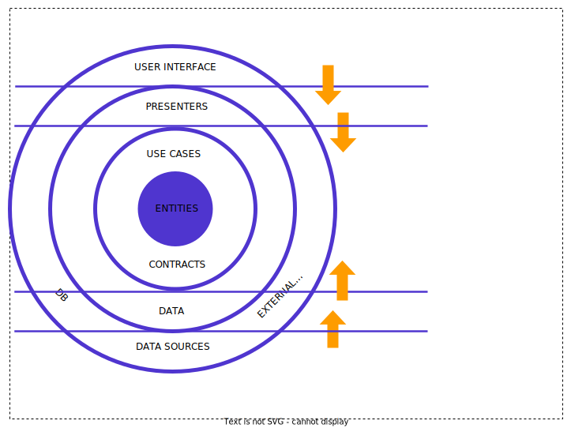
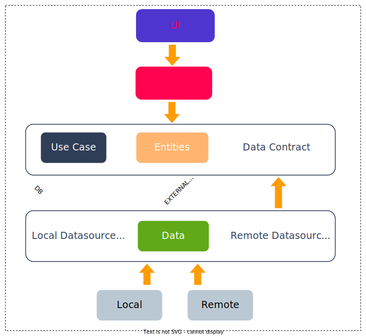

# CLEAN Architecture Overview

## CLEAN Architecture by Robert C. Martin

This project (a relatively simple one) is an attempt to adapt CLEAN architecture in Android.  It showcases usage of Android Architecture Components with Hilt together to achieve the CLEAN architecture.  Please note, this is an adaptation of the original idea presented by Rober C. Martin in his [blog](http://blog.cleancoder.com/uncle-bob/2012/08/13/the-clean-architecture.html) and book ["Clean Architecture: A Craftsman's Guide to Software Structure and Design"](https://www.amazon.com/Clean-Architecture-Craftsmans-Software-Structure/dp/0134494164), the core principles are intact but other rules are modified to showcase working of HILT and Room with LiveData.

## Onion Layers CLEAN Architecture

All the layers or CLEAN architecture has been separated into individual modules in a single Android studio project. For example there are pure Kotlin modules like `domain` and `data`, android library modules like `presentation` and `app`. Notice the dependency of these modules. As per the depedency rule of CLEAN architecture, all the dependencies directly or indirectly point towards the the domain layer or module. The domain layer incorporates `entities`, `use-cases` and interfaces required to cross boundaries, `Repository` in this case.

Having separate modules is not necessary, you can create all the laters in the app modules itself. Having separate modules and depending on the intended modules prevent accidental usage of a classes in unintended places.

### Dependency Rule

- Outer circles are mechanisms and solutions (like UI, networking solution, persistence solution etc.)
- The inner circles are rules and policies (the core business logic)
- Dependencies can only point inwards (from concretions towards abstractions)
- Inner circles know nothing about outer circles, hence, outer data formats can’t be used in inner circles
- Dependencies must point towards Stability
- Dependencies must point towards Abstractions

## CLEAN Architecture in Android App

Let’s start explaining Data Flow in the Architecture as follows,

1. UI (Activity/Fragment) calls method from `ViewModel`.
2. `ViewModel` executes request(use-case) with the help of [Request Manager](request-manager.md).
3. The request is further wrapped within a [exception handler](exception-handling.md) to manage automatic exception handling.
4. The request combines data from multiple repositories.
5. Each Repository can return data from multiple **Data Source** (Cached, Remote or more).
6. Information flows back to the UI where we display the list of requested information.

## Implementing CLEAN Architecture in Android App

