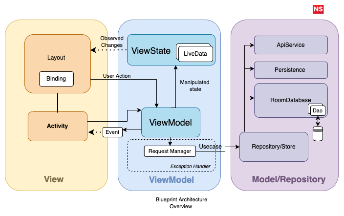

# Architectural Overview

## Data Flow

Let’s start explaining Data Flow in the Architecture as follows,

1. UI (Activity/Fragment) calls method from `ViewModel`.
2. `ViewModel` executes request(use-case) with the help of [Request Manager](request-manager.md).
3. The request is further wrapped within a [exception handler](exception-handling.md) to manage automatic exception handling.
4. The request combines data from multiple repositories.
5. Each Repository can return data from multiple **Data Source** (Cached, Remote or more).
6. Information flows back to the UI where we display the list of requested information.

## Module Types and Dependencies

The application adopts modularized code-base approach which provides few benefits like,

* Better [separation of concerns](https://en.wikipedia.org/wiki/Separation_of_concerns). Each module has a clear API., Feature related classes live in different modules and can't be referenced without explicit module dependency.
* Faster compile time

Following are the project modules,

1. #### App/UI Layer or `app` **module** 

   This is the main module. It contains code that wires multiple modules together (dependency injection setup, etc.) and fundamental application configuration (network configuration, database configuration, required permissions setup, custom application class, etc).

   This layer is closest to what the user sees on the screen. The `UI` layer has actions that modify the ` state` of the view and then new state is edited to a view via `LiveData` to be rendered.

   Components:
   - **View (Activity/Fragment)** - presents data on the screen and pass user interactions to View Model. Views are hard to test, so they should be as simple as possible.
   - **Screen Navigation** - That facilitates handling all navigation between different activities.

2. #### Presentation layer

   The `presentation` layer is a mix of `MVVM` (Jetpack `ViewModel` used to preserve data across activity restart)
   
   The presentation layer prepares data for the application layer. The presentation layer takes any data transmitted by the application layer and prepares it for transmission over the other layer & vice versa.

   Components:

   - **ViewModel** - dispatches (through `LiveData`) state changes to the view and deals with user interactions (these view models are not simply [POJO classes](https://en.wikipedia.org/wiki/Plain_old_Java_object)).
   - **ViewState** - state for a single view witin the viewmodel

3. #### Domain layer

   This is the core layer of the application. Notice that the `domain` layer is independent of any other layers. This allows to make domain models and business logic independent from other layers. In other words, changes in other layers will have no effect on `domain` layer eg. changing database (`data` layer) or screen UI (`presentation` layer) ideally will not result in any code change withing `domain` layer.

   Components:

   - **UseCase/Requests** - contains business logic for a particular scenario
   - **Domain Models** - defines the core structure of the data that will be used within the application. This is the source of truth for application data.
   - **Repository interface** - required to keep the `domain` layer independent from the `data layer` ([Dependency inversion](https://en.wikipedia.org/wiki/Dependency_inversion_principle)).
   
4. #### Data layer

   Manages application data and exposes these data sources as repositories to the `domain` layer. Typical responsibilities of this layer would be to retrieve data from the internet and optionally cache this data locally.

   Components:

   - **Repository** is exposing data to the `domain` layer. Depending on application structure and quality of the external APIs repository can also merge, filter, and transform the data. The intention of these operations is to create high-quality data source for the `domain` layer, not to perform any business logic (`domain` layer `use case` responsibility).
     To learn more about repository pattern see,
     - [ Why should you use the repository pattern?](../discussion/WHY_REPOSITORY.md)
     - [ The Repository Pattern](repository-pattern.md).
   - **Mapper** - maps `data model` to `domain model` (to keep `domain` layer independent from the `data` layer).
   - **RetrofitService** - defines a set of API endpoints.
   - **AppDatabase** - makes room database accessible through data access objects (`dao`) 
   - **DataModel** - defines the structure of the data retrieved from the network , database  or any other datasource for instance retrofit model class has annotations, so Retrofit (Moshi) understands how to parse this network data (XML, JSON, Binary...) this data into objects.

To know more about CLEAN architecture in Android please refer [here](app-clean-arch-overview.md).

## Dependency management

This project utilizes multiple mechanics to easily share the same versions of dependencies like [KotlinDSL](https://docs.gradle.org/current/userguide/kotlin_dsl.html).

Dependencies are inside the *.kt files in the `buildSrc` folder. This provides convenient auto-completion when writing your gradle files & can be shared between multiple modules.

