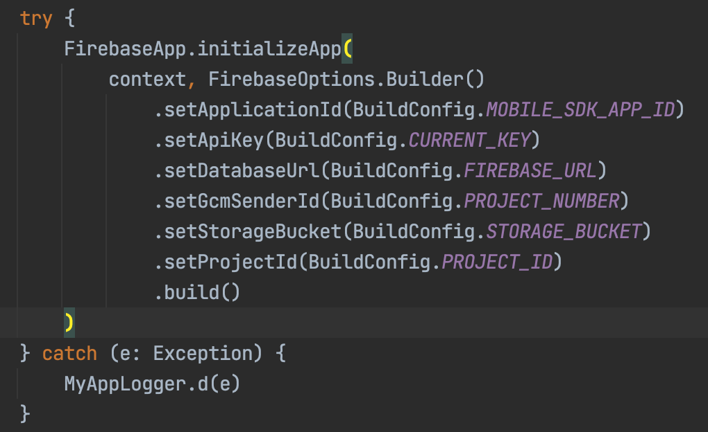
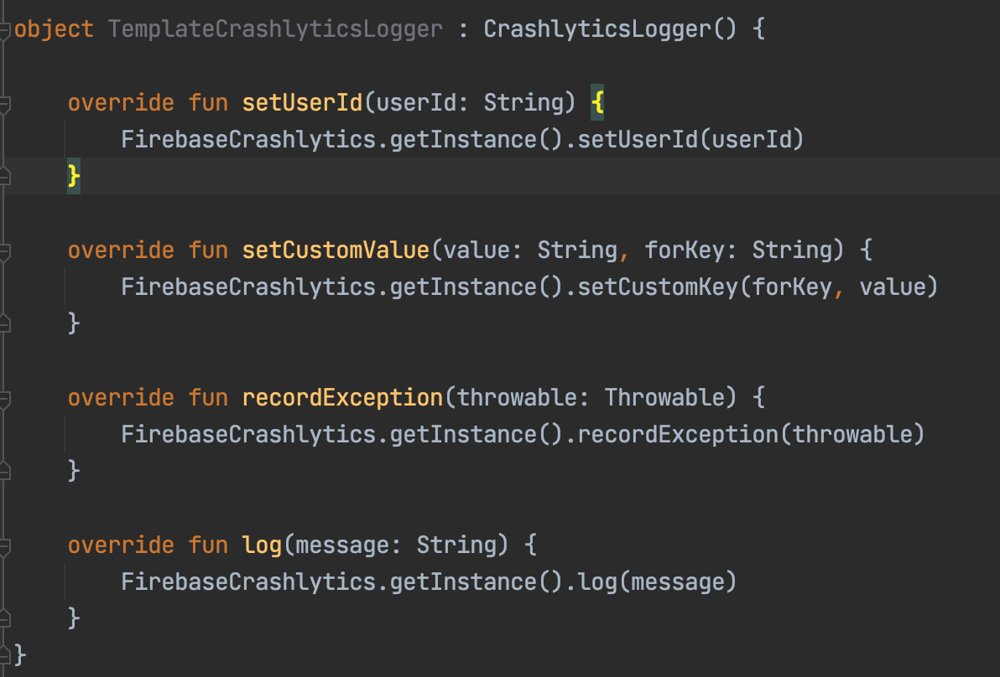

# Crash reporting

Crash reporting is use to report the exceptions, custom values, logs etc.we have used firebase crashlytics for the same in the app.

## Usability

1) First of all we need to enable firebase to the app from the console.

2) The next step would be to add necessary dependancy in the app and module gradle file.

3) Then we need to download the json file from the firebase and include that in the app folder.

4) Above steps has some security concerns as there will some critial information present in the json file.so to overcome the problem we have provided the values through gradle.

5) we have defined the necessary information in the enviorment variable and in the build config get the same information like below.

   ```
   buildConfigField "String", "MOBILE_SDK_APP_ID", System.getenv("MOBILE_SDK_APP_ID") ?: "\"YOUR_MOBILE_SDK_APP_ID\""
   buildConfigField "String", "CURRENT_KEY", System.getenv("CURRENT_KEY") ?: "\"YOUR_CURRENT_KEY\""
   buildConfigField "String", "FIREBASE_URL", System.getenv("FIREBASE_URL") ?: "\"YOUR_FIREBASE_URL\""
   buildConfigField "String", "PROJECT_NUMBER", System.getenv("PROJECT_NUMBER") ?: "\"YOUR_PROJECT_NUMBER\""
   buildConfigField "String", "STORAGE_BUCKET", System.getenv("STORAGE_BUCKET") ?: "\"YOUR_STORAGE_BUCKET\""
   buildConfigField "String", "PROJECT_ID", System.getenv("PROJECT_ID") ?: "\"YOUR_PROJECT_ID\""
   ```

6. If the values are not provided through enviourment variable we recommend to provide them like above just replace the values instead of YOUR_MOBILE_SDK_APP_ID and likewise.

7. as we have provided values through gradle we dont need to json file any more in the step3

8. as we have used this approach firebase initialisation should be done in the app like

   

9. Now to report an exception we have predefined methods defined in the CrashlyticsLogger.we need to implement methods of this class and call the desired function like below.

   

   