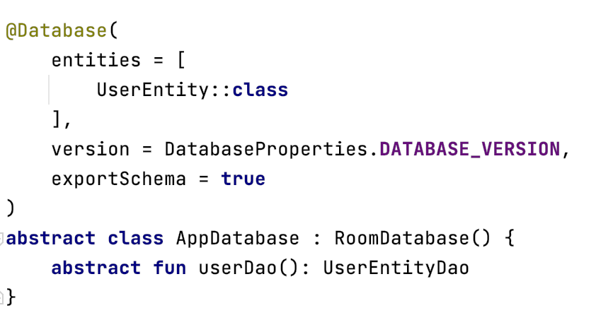
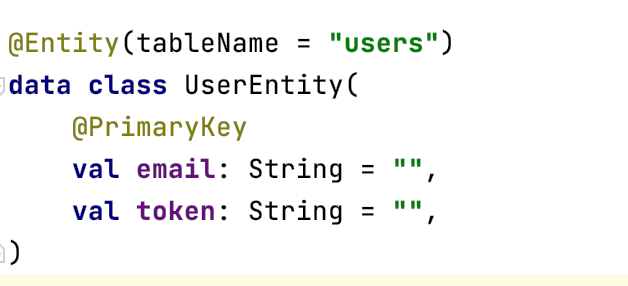
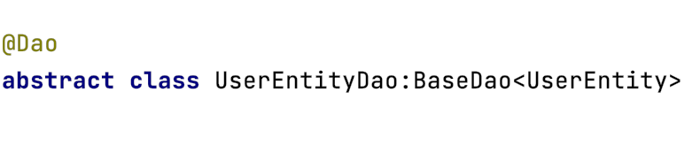

# Database

The template includes **Room database** with the core level modules. To leverage the
functionality, we need to define the following files & update the data services files as per your requirement.

### **Primary Components of Room**

1. **Database Properties**: The class contains the information about database configs in `DatabaseProperties`. You can modify the `DATABASE_NAME` name to be stored on disk to the desired values as required.
   Similarly `DATABASE_VERSION` can be incremeted & migration can be defined in the same config file.

2. **Database Class:** This provides the main access point to the underlying connection for the application’s persisted data. And this is annotated with` @Database`

   `AppDatabase` 
   

3. **Data Entities:** This Represents all the tables from the existing database. And annotated with **@Entity.**

   `Entity`

   

   Room allows you to create tables via an [Entity](https://developer.android.com/training/data-storage/room/defining-data.html).   You can add more tables by marking a class with `@Entity` & adding them to you `AppDatabase` class.

3. **DAO (Data Access Objects):** This contains methods to perform the operations on the database. And annotated with **@Dao.**

   
   
   Room uses the [DAO](https://developer.android.com/training/data-storage/room/accessing-data.html) (data access object) to create a clean API for your code.  You can add more daos by marking a class with `@Dao` & adding them to you `AppDatabase` class to access.
   
   The DAO must be an interface or abstract class.

By default, all queries must be executed on a separate thread.

The database schema defined is exported to `data/schemas` path for future reference as the system increments.
