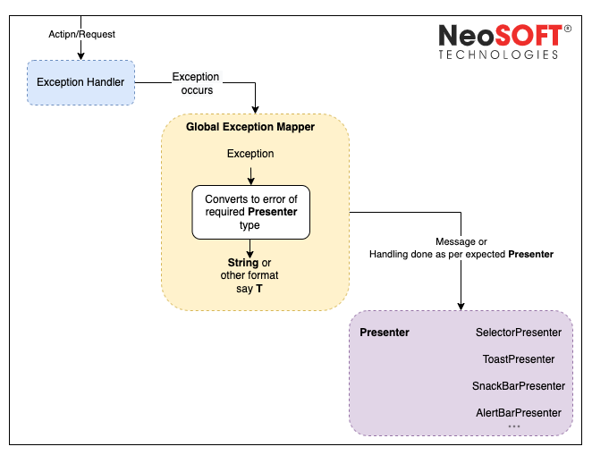
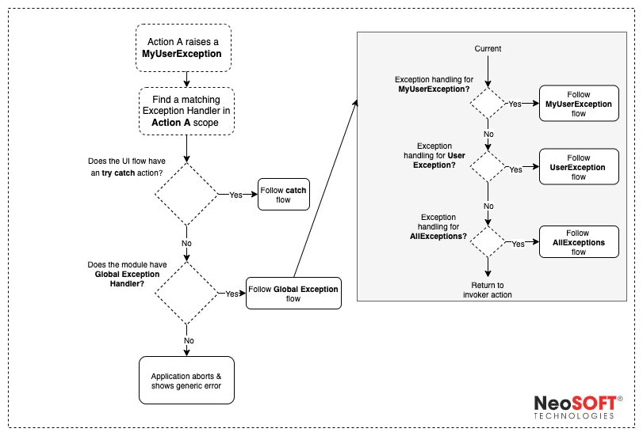

# Automated Exceptions Handler

[TOC]

### Overview

Automated exceptions handler for Kotlin which provides automatic exception handling and 
automatic error displaying to a screen.

Implementation structure:

* The `/errors` - Pure Kotlin Module/Library includes exception handling core implementation 
* The `/errors` Package in the  `/app` module  - Android dependent implementation for automatic exception handling


### Features

- **ExceptionHandler** implements safe code execution and automatic exception display using **ErrorPresenter**.

- **ExceptionMappers** singleton object, storage that stores a set of exception converters to error classes required for **ErrorPresenter** objects.

- **ErrorPresenter** classes implements a strategy for displaying exceptions in a user-friendly form on the platforms. Converts the exception class to an error object to display. 

  

  There are several `ErrorPresenter` implementations:

  1. `AlertErrorPresenter` - displays errors text in alert dialogs.
  2. `ToastErrorPresenter` - displays errors text in toasts for Android
  3. `SnackBarErrorPresenter` - displays errors text in snackbar for Android.
  4. `SelectorErrorPresenter` - for selecting error presenter by some custom condition.



### Usage





#### ExceptionMappers

Register a simple custom exceptions mapper in the singleton storage:

```kotlin
ExceptionMappers
    .register<IllegalArgumentException, String> {   // Will map all IllegalArgumentException instances to String
        "Illegal argument was passed!"
    }
    .register<HttpException, Int> {                     // Will map all HttpException instances to Int
        it.code
    }
```

Registration of custom exception mapper with condition:

```kotlin
ExceptionMappers.condition<String>(              // Registers exception mapper Throwable -> String
    condition = { it is CustomException && it.code == 10 }, // Condition that maps Throwable -> Boolean
    mapper = { "Custom error happened!" }            // Mapper for Throwable that matches to the condition
)
```

For every error type you should to set fallback (default) value using method `setFallbackValue`

```kotlin
ExceptionMappers
    .setFallbackValue<Int>(250) // Sets for Int error type default value as 250

// Creates new mapper that for any unregistered exception will return the fallback value - 250
val throwableToIntMapper: (Throwable) -> Int = ExceptionMappers.throwableMapper()
```

Using factory method `throwableMapper` you can create exception mappers automaticlly:

```kotlin
val throwableToIntMapper: (Throwable) -> Int = ExceptionMappers.throwableMapper()
```

If a default value is not found when creating a mapper using factory method `throwableMapper`, an exception will be thrown `FallbackValueNotFoundException`

The registration can be done in the form of an endless chain:

```kotlin
ExceptionMappers
    .condition<String>(
        condition = { it is CustomException && it.code == 10 },
        mapper = { "Custom error happened!"}
    )
    .register<IllegalArgumentException, String> {
        "Illegal argument was passed!"
    }
    .register<HttpException, Int> {
        it.code
    }
    .setFallbackValue<Int>(250)
```


#### ExceptionHandler

1. Declare `ExceptionHandler` property in some `ViewModel` class:

```kotlin
class SampleViewModel(
    val exceptionHandler: ExceptionHandler
) : ViewModel() {
    // ...
}

```

2. Bind `ExceptionHandler` in the platform code.
   On Android in an `Activity` of `Fragment`:

   ```kotlin
   viewModel.exceptionHandler.bind(
       lifecycleOwner = this,
       activity = this
   )
   ```

3. Creating instances of `ExceptionHandler` class which uses `(Throwable) -> String` mappers:

   ```kotlin
   ExceptionHandler<String>(
       errorPresenter = errorsPresenterInstance,                    // Concrete ErrorPresenter implementation
       exceptionMapper = ExceptionMappers.throwableMapper(), // Create mapper (Throwable) -> String from ExceptionMappers
       onCatch = {                                                  // Optional global catcher
           println("Got exception: $it")                            // E.g. here we can log all exceptions that are handled by ExceptionHandler
       }
   )
   ```

4. And use it to safe requests in `ViewModel`:

   ```kotlin
   fun onMakeRequest() {
       viewModelScope.launch {
           exceptionHandler.handle {
               serverRequest()     // Some dangerous code that can throw an exception
           }.finally {             // Optional finally block
               // Some code        
           }.execute()             // Starts code execution in `handle` lambda
       }
   }
   ```

5. Also you can add some custom `catch` handlers for `ExceptionHandler` that work as a catch in the try/catch operator:

   ```kotlin
   fun onMakeRequest() {
       viewModelScope.launch {
           exceptionHandler.handle {
               serverRequest()
           }.catch<IllegalArgumentException> {     // Specifying exception class
               // Some custom handler code
               false                               // true - cancels ErrorPresenter; false - allows execution of ErrorsPresenter
           }.execute()                             // Starts code execution in `handle` lambda
       }
   }
   ```

   

#### ErrorPresenter

There are `ErrorPresenter` interface implementations:

##### AlertErrorPresenter

 Displays errors text in alert dialogs

##### ToastErrorPresenter

Displays errors text in toasts for Android.

##### SnackBarErrorPresenter

Displays errors text in snackbar for Android.

##### SelectorErrorPresenter

For selecting error presenter by some custom condition.


You need to pass some `ErrorPresenter` to `ErrorHandler` instance. E.g. creation of error presenters in common code:

```kotlin
val alertErrorPresenter = AlertErrorPresenter(
    alertTitle = "Error",
    positiveButtonText = "OK"
)
val toastErrorPresenter = ToastErrorPresenter(
    duration = ToastDuration.LONG
)
```

`SelectorErrorPresenter` - special presenter that select some error presenter by custom condition lambda which should return some `ErrorPresenter` to be used for showing errors:

```kotlin
val selectorErrorPresenter = SelectorErrorPresenter { throwable ->
    when (throwable) {
        is CustomException -> alertErrorPresenter
        else -> toastErrorPresenter
    }
}
```

And pass some `ErrorPresenter` to `ErrorHandler`:

```kotlin
val exceptionHandler = ExceptionHandler(
    errorPresenter = selectorErrorPresenter,
    exceptionMapper = ExceptionMappers.throwableMapper()
)
```
