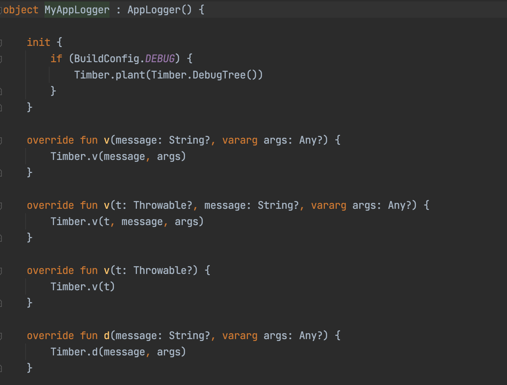

# Logger

Logger module is used to support text-based logging.there are different levels of logging we can achieve like warn, error,debug etc.

## Usability

There are functions available in the core logger module in file **AppLoggerBinder**,we need to implement that and call the desired function for logging.

in the app we have used **Timber** as a logging library.we need to plant/initialize the timber like Timber.plant(Timber.DebugTree())

