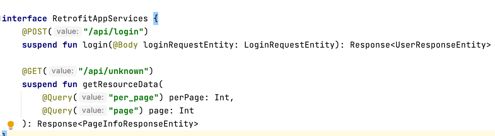
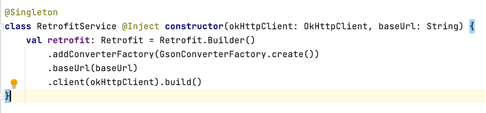
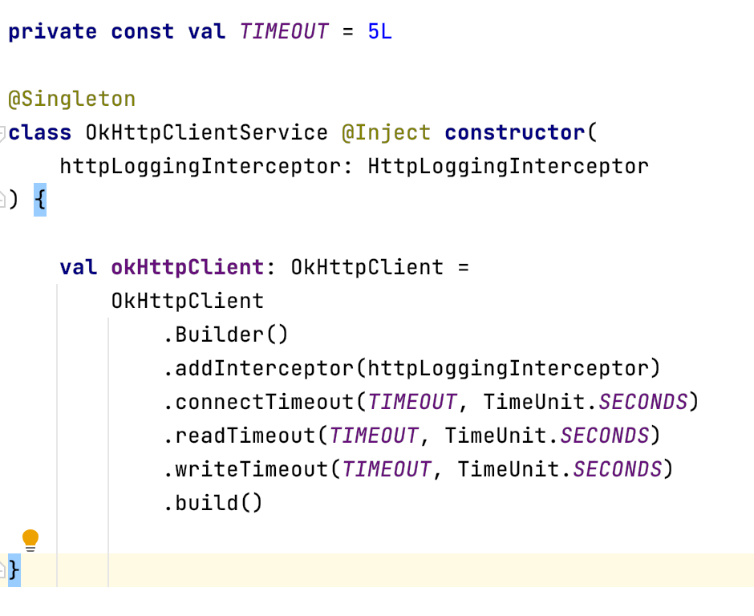

# Network

The template includes **Retrofit network library** with the core level modules. To leverage the
functionality, we need to define the following files & update the data services files as per your requirement.

# Retrofit

It is type-safe HTTP client for Android and Java.

* Retrofit turns your HTTP API into a Java interface defined in `RetrofitAppServices`.
  

* The `Retrofit` class generates an implementation of the `RetrofitAppServices` interface.

  
  
* Each `Call` from the created `RetrofitAppService` can make a synchronous or asynchronous HTTP request to the remote webserver.


### **Primary Components of Retrofit**

#### REQUEST METHOD

Every method must have an HTTP annotation that provides the request method and relative URL. There are eight built-in annotations: `HTTP`, `GET`, `POST`, `PUT`, `PATCH`, `DELETE`, `OPTIONS` and `HEAD`. The relative URL of the resource is specified in the annotation.

```
@GET("users/list")
```

You can also specify query parameters in the URL.

```
@GET("users/list?sort=desc")
```

#### URL MANIPULATION

A request URL can be updated dynamically using replacement blocks and parameters on the method. A replacement block is an alphanumeric string surrounded by `{` and `}`. A corresponding parameter must be annotated with `@Path` using the same string.

```
@GET("group/{id}/users")
Call<List<User>> groupList(@Path("id") int groupId);
```

Query parameters can also be added.

```
@GET("group/{id}/users")
Call<List<User>> groupList(@Path("id") int groupId, @Query("sort") String sort);
```

For complex query parameter combinations a `Map` can be used.

```
@GET("group/{id}/users")
Call<List<User>> groupList(@Path("id") int groupId, @QueryMap Map<String, String> options);
```

#### REQUEST BODY

An object can be specified for use as an HTTP request body with the `@Body` annotation.

```
@POST("users/new")
Call<User> createUser(@Body User user);
```

The object will also be converted using a converter specified on the `Retrofit` instance. If no converter is added, only `RequestBody` can be used.

#### HEADER MANIPULATION

You can set static headers for a method using the `@Headers` annotation.

```
@Headers("Cache-Control: max-age=640000")
@GET("widget/list")
Call<List<Widget>> widgetList();
@Headers({
    "Accept: application/vnd.github.v3.full+json",
    "User-Agent: Retrofit-Sample-App"
})
@GET("users/{username}")
Call<User> getUser(@Path("username") String username);
```

Note that headers do not overwrite each other. All headers with the same name will be included in the request.

A request Header can be updated dynamically using the `@Header` annotation. A corresponding parameter must be provided to the `@Header`. If the value is null, the header will be omitted. Otherwise, `toString` will be called on the value, and the result used.

```
@GET("user")
Call<User> getUser(@Header("Authorization") String authorization)
```

Similar to query parameters, for complex header combinations, a `Map` can be used.

```
@GET("user")
Call<User> getUser(@HeaderMap Map<String, String> headers)
```

Headers that need to be added to every request can be specified using an [OkHttp interceptor](https://github.com/square/okhttp/wiki/Interceptors).


## OkHttp Configuration

OkHttp Configuration can be found in `OkHttpClientService`
