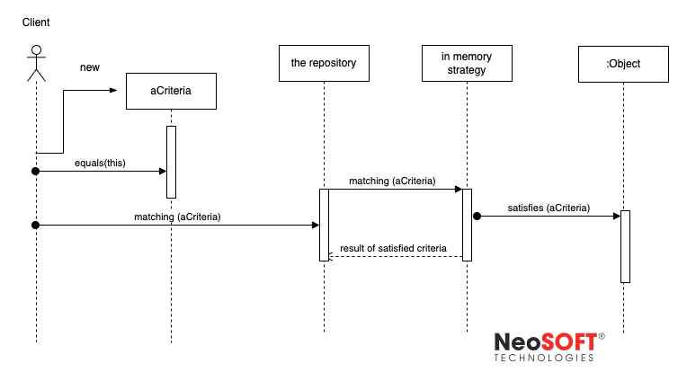

# The Repository Pattern

In many applications, the business logic accesses data from data stores such as databases or web services. Directly accessing the data can result in the following:

- Duplicated code
- A higher potential for programming errors
- Weak typing of the business data
- Difficulty in centralizing data-related policies such as caching
- An inability to easily test the business logic in isolation from external dependencies

# Objectives

Use the Repository pattern to achieve one or more of the following objectives:

- You want to maximize the amount of code that can be tested with automation and to isolate the data layer to support unit testing.
- You access the data source from many locations and want to apply centrally managed, consistent access rules and logic.
- You want to implement and centralize a caching strategy for the data source.
- You want to improve the code's maintainability and readability by separating business logic from data or service access logic.
- You want to use business entities that are strongly typed so that you can identify problems at compile time instead of at run time.
- You want to associate a behavior with the related data. For example, you want to calculate fields or enforce complex relationships or business rules between the data elements within an entity.
- You want to apply a domain model to simplify complex business logic.
  

> Repository architectural pattern creates a uniform layer of data repositories that can be used for CRUD operations.

# Solution

Use a repository to separate the logic that retrieves the data and maps it to the entity model from the business logic that acts on the model.

The business logic should be agnostic to the type of data that comprises the data source layer.

For example, the data source layer can be a database, a shared preference, or a Web service.

​		*In the above diagram, the **aCriteria** refers to a usecase requested by presentation layer/client*

The repository mediates between the data source layer and the business layers of the application. It queries the data source for the data, maps the data from the data source to a business entity, and persists changes in the business entity to the data source. A repository separates the business logic from the interactions with the underlying data source or Web service. The separation between the data and business tiers has three benefits:

- It centralizes the data logic or Web service access logic.
- It provides a substitution point for the unit tests.
- It provides a flexible architecture that can be adapted as the overall design of the application evolves.

Repositories are bridges between data and operations that are in different domains. A common case is mapping from a domain where data is weakly typed, such as a database or a list, into a domain where objects are strongly typed, such as a domain entity model.

A repository issues the appropriate queries to the data source, and then it maps the result sets to the externally exposed business entities.

Repositories remove dependencies that the calling clients have on specific technologies. For example, if a client calls a catalog repository to retrieve some product data, it only needs to use the catalog repository interface.

Repository also supports the objective of achieving a clean separation and one-way dependency between the domain and data mapping layers.