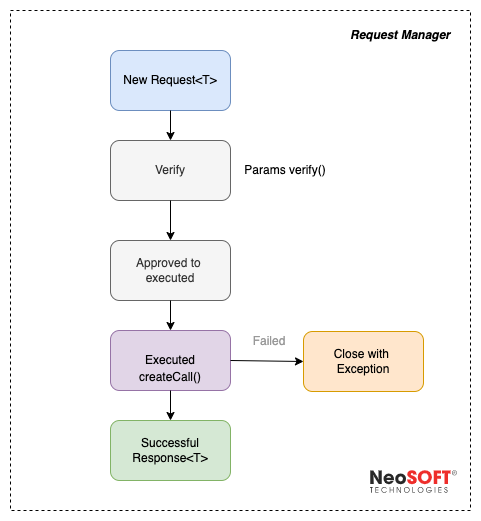

# Request Manager

Request manager is used to process any request from Viewmodel to respective Repositories.



## Usability

1. Wrap the request inside the `RequestManager` object like below, here `T` can be class of interest for example User in this case,

   ```kotlin
   object : RequestManager<T>(params:Params) {
       override suspend fun createCall(): Either<BaseError, User> {
           return userRepository.login(params)
       }
   }.asFlow().collect {
       _tokenFlow.value = it
   }
   ```
   
2. **params** : It will check all the presentation validation like checking if email is present and is it valid or not or any parameters which needs to be verified before executing the use case.

3. **createCall** :- Any request/use-case which is suspend function can be executed here.

4. The result from request can be captured or collected as a flow using `asFlow`

5. The result returns an instance of a  [Resource](https://github.com/NeoSOFT-Technologies/mobile-android/blob/main/domain/src/main/java/com/core/utils/Resource.kt) which contains data that can be used by the UI - this includes the ResourceState (LOADING,SUCCESS,ERROR), data to be used by the UI and a message if required (for error states).

6. To handle the exception for the each request we need to wrap the above RequestManager call in ExceptionHandler to manage the exception automatically. Request is handled via exception handler and the exception is received in the catch block.		

   ```kotlin
   exceptionHandler.handle {
       object : RequestManager<User>(params = params) {
           override suspend fun createCall(): Either<BaseError, User> {
               return userRepository.login(params)
           }
       }.asFlow().collect {
           _tokenFlow.value = it
       }
   }.catch<Exception> {
       false
   }.execute()
   ```
   
7. If you wish to handle the exception to make some custom behaviour to your UI you can return `true` else return `false` when u want the automatic exception handler behaviour defined in the viewmodel.

  	 To learn more about architecture see [`ExceptionHandler`](exception-handling.md)

